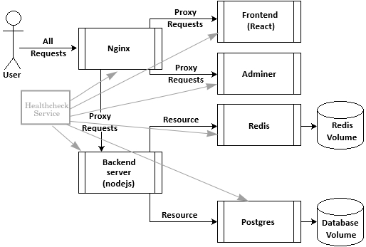

# contenairazed web app with CDE, CICD on cloud

## The net


## Container on board
- Nginx as reverse proxy
- frontend of webapp in React
- backend of webapp with nodejs
- DB with postgres
- Caching with redis
- DB managment with Adminer

## Healtchecks
The health check session will ping the containers to check their availability
### All up

### Redis Shutdown from docker desktop

### Postgres Shutdown from docker desktop

### Frontend Shutdown from docker desktop

### Nginx Shutdown from docker desktop

### Backend Shutdown from docker desktop


## Compose the webapp


## Redis 


## DB managing with adminer


## Setup the project
1. Create a new React app:

```bash
npx create-react-app frontend
cd frontend
```
2. modify the app.js
3. back in the root

```bash
mkdir backend && cd backend
npm init -y
npm install express pg cors dotenv body-parser
```
4. initalize Postgres:
    2 ways:
        - init.sql file in the root
        - migrate.js file managed by js. you have to modify the run script as well

5. install redis: ```npm install redis```

6. Crate dockerfiles and docker compose.
7. build with: ```docker-compose up --build```

### Contenarized Development Environment

#### Some links

- [DEvOps with Docker: Containers in development](https://courses.mooc.fi/org/uh-cs/courses/devops-with-docker/chapter-3/containers-in-development)
- [Basics of Orchestration: Development in containers](https://fullstackopen.com/en/part12/basics_of_orchestration#development-in-containers)
- [Developer’s Perspective on Containerized Development Environments : A Case Study and Review of Gray Literature](https://helda.helsinki.fi/items/9f681533-f488-406d-b2d8-a2f8b225f283)

8. for **Contenarized Development Environment**:
    - run this in the backend folder: ```npm install --save-dev nodemon```
    - bind mount settling
    - activate polling
    - update script at start directly in the package.json:
      - front: 
        ```json
        "scripts": {
            "start": "react-scripts start",
            "build": "react-scripts build",
            "test": "react-scripts test",
            "eject": "react-scripts eject"
        },
        ```
      - back:
          ```json
              "scripts": {
                  "test": "echo \"Error: no test specified\" && exit 1",
                  "start": "node server.js",
                  "dev": "nodemon server.js"
              },
          ```

## Listening

- Reverse proxy entrypoint: `http://localhost`
- React frontend will be available at `http://localhost:3000`, 
- Node.js backend will run on `http://localhost:5000`